# Mix Pack Workout (Project Images Below)
### A CRUD app to customize a workout and set a workout schedule (including Google Auth).

## React / Redux with backend server
## Login with Google authentication

## (A) To create your own Google Auth sign in for users:
#### 1. Go to console.developers.google.com
#### 2. Create a new project -> name it -> click Create
#### 3. Go to credentials -> choose external -> Create
#### 4. Enter your app name -> click save
#### 5. At root of CLIENT (not API) part of application create a .env file and inside type:
####  a) REACT_APP_GOOGLE_API_CLIENT_ID=Enter your client id here
####  b) REACT_APP_GOOGLE_API_SCOPE=email

## (B) To Run App:
#### 1. From CLIENT directory -> yarn start -> run on Localhost:3000.
#### 2. From API directory (NOT apis directory inside of client folder) -> npm install -> yarn start -> run on Localhost:3001.

## (C) To run the YouTube In-App viewer for /workouts/videos:
#### 1. Get a YouTube API key from console.developers.google.com  
#### 2. Inside .env file created in step (A) above type: REACT_APP_YOUTUBE_API_KEY=Your API Key
______________
<h2 align="center">App Images (Desktop View):</h4>

  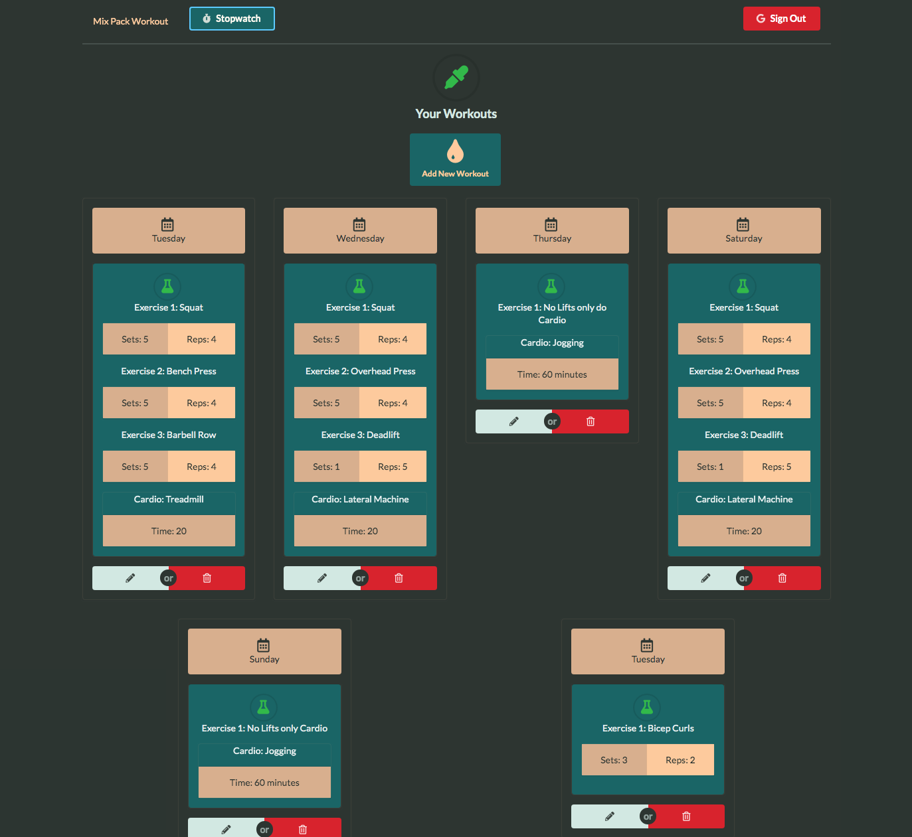
  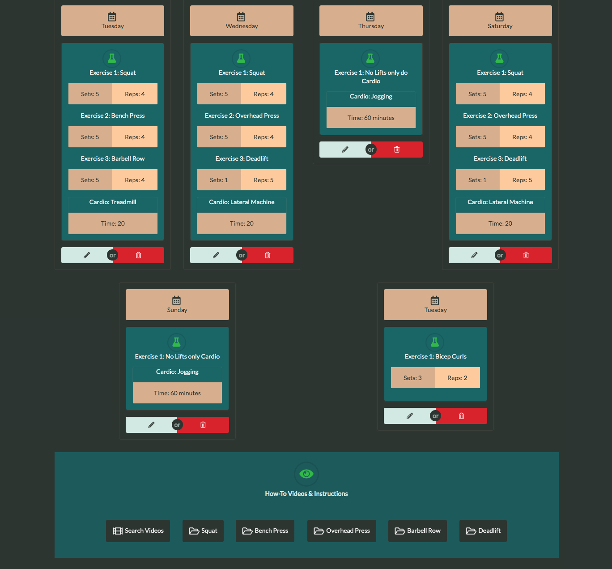
  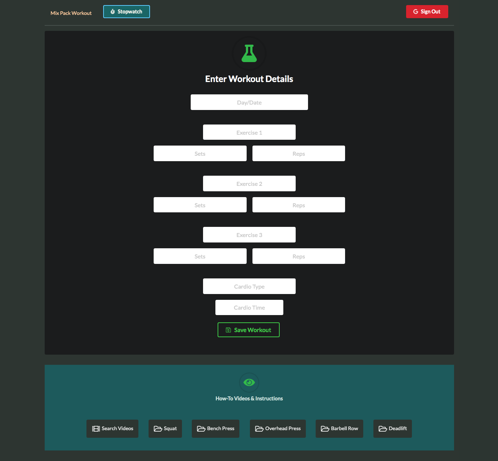
  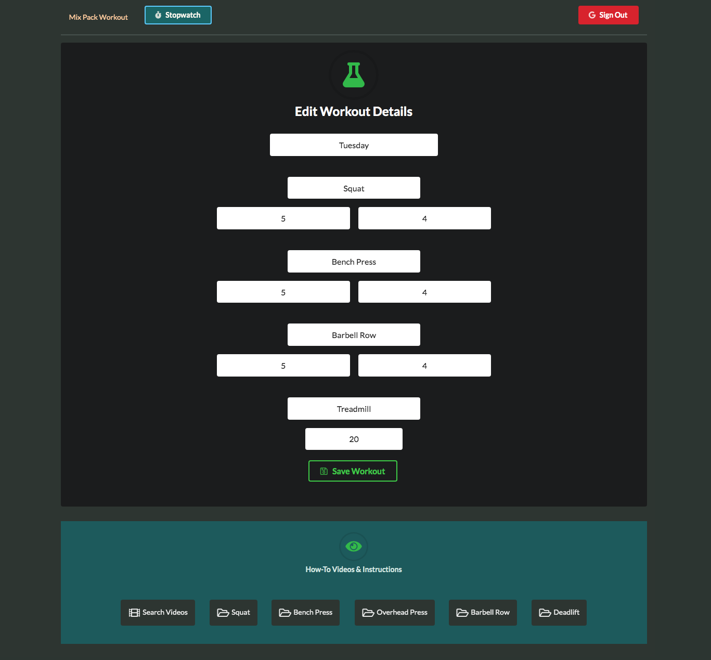
  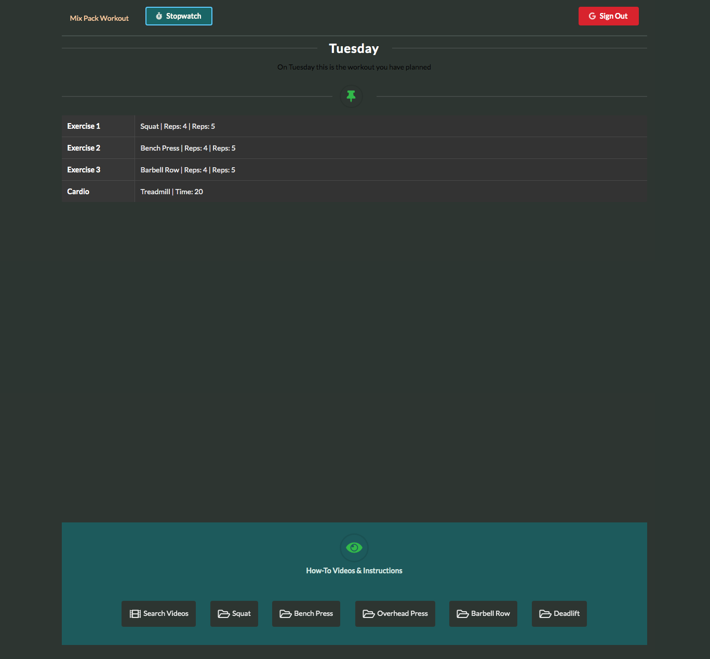
  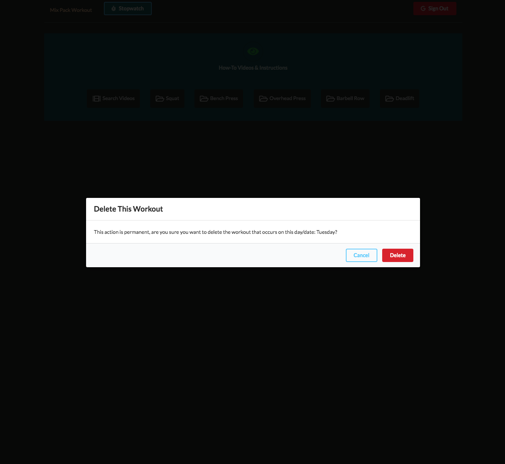
  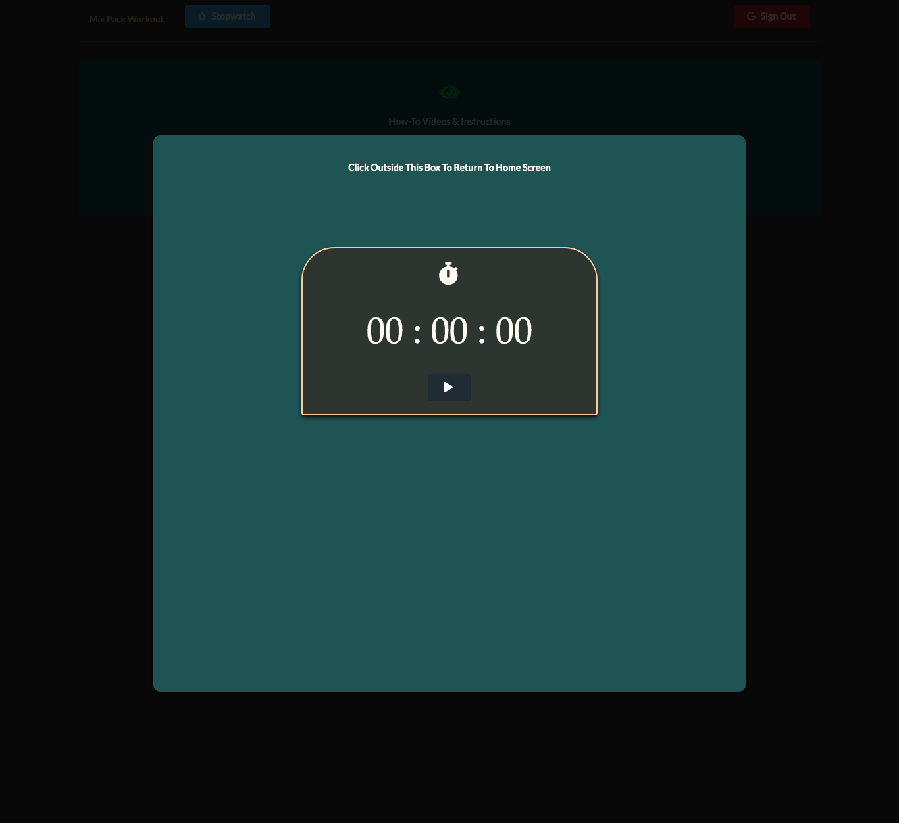
  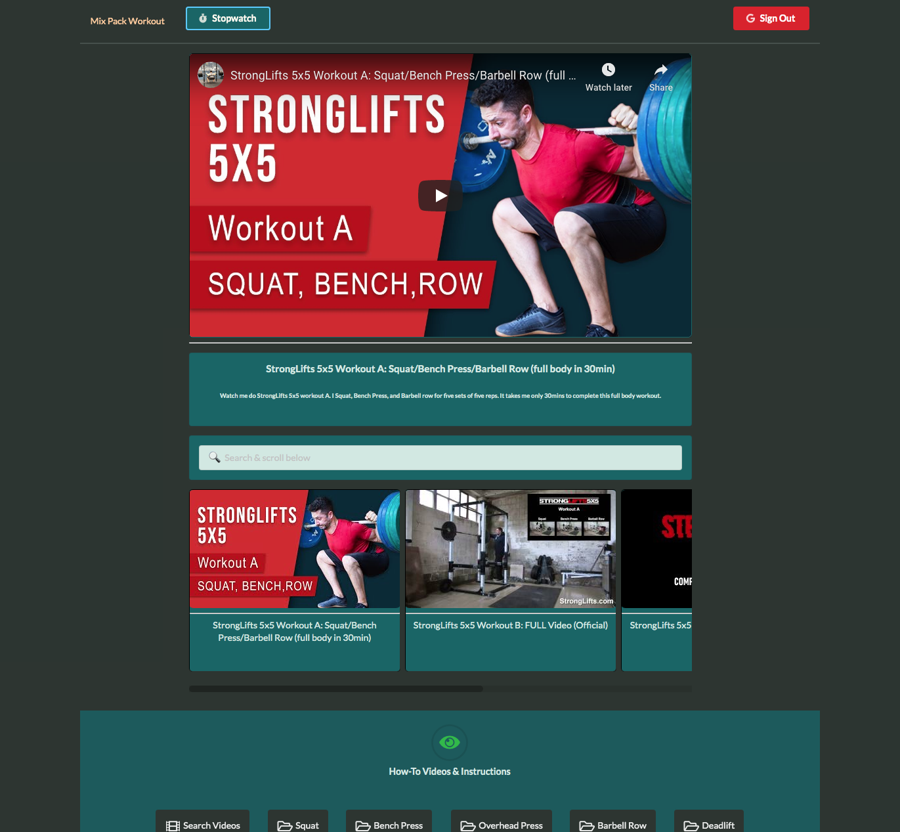
  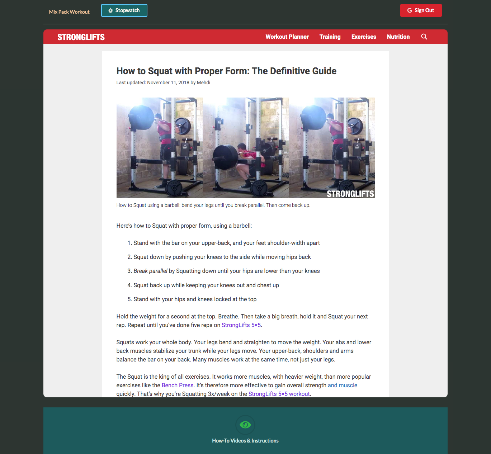

<h2 align="center">App Images (Mobile View):</h4>

  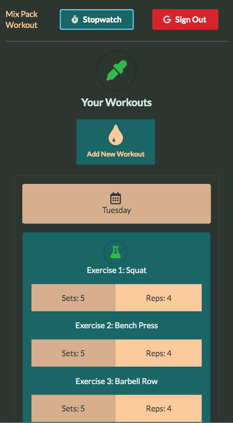
  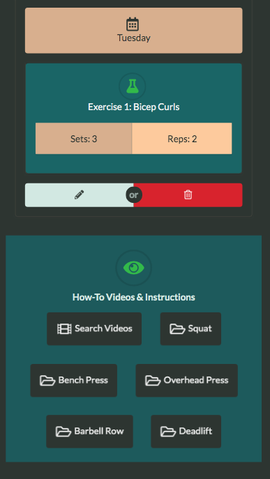
  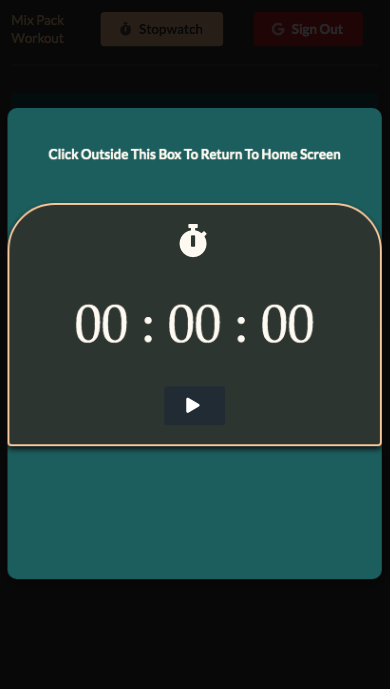
  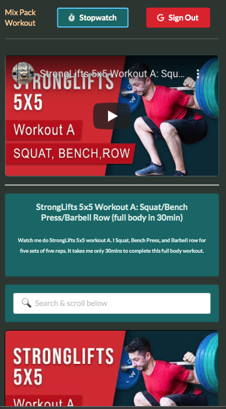

